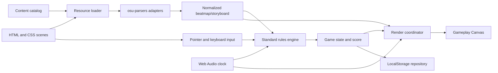

# Web osu!standard Rhythm Game - Technical Requirements Document

> 문서 버전: 2.8  
> 작성 기준일: 2026-08-29  
> 상태: 싱글 플레이 MVP 기술 기준  
> 대응 제품 문서: `PRD.md`  
> 대상 콘텐츠: `toby fox - MEGALOVANIA` / `- YUGEN -`

버전 2.8은 바깥쪽 `- YUGEN -/`의 직접 파일을 active skin source로 고정하고 실제 bitmap 크기·투명 placeholder·고해상도 naming·WAV/MP3 profile·명시적 무음을 fixture로 삼는다. `play.mp4` 분석은 렌더링·HUD·피드백·break·결과 presentation 기준이며 영상의 replay 점수·정확도·UR·pp·입력 trace나 map/video 대응 오프셋은 MVP 규칙 계약으로 승격하지 않는다. `gameex.md`도 기존 관찰을 폐기하고 같은 `play.mp4` presentation 계약으로 개정되었다.

## 1. 기술 목표와 범위

이 문서는 `387700 toby fox - MEGALOVANIA/`의 다섯 osu!standard 비트맵과 바깥쪽 `- YUGEN -/` 스킨을 PC 웹 브라우저에서 플레이하기 위한 구현 계약을 정의한다. 초기 결과물은 Vite로 빌드하고 Vercel에 배포하는 정적 웹 애플리케이션이다.

핵심 기술 목표는 다음과 같다.

- `.osu` file format v14와 `.osb`를 브라우저에서 파싱한다.
- Hit Circle, Slider, Spinner를 이 문서에 고정한 osu!standard 기반 프로젝트 규칙으로 처리한다.
- Web Audio API의 시간을 음악, 판정, 렌더링과 스토리보드의 단일 기준 시계로 사용한다.
- Canvas 2D에서 512×384 플레이필드와 640×480 스토리보드 좌표계를 정확히 변환한다.
- 마우스 좌·우 버튼과 `Z`·`X` 입력을 같은 게임 액션으로 정규화한다.
- 판정·점수·HP를 렌더러와 분리해 순수 로직으로 테스트한다.
- 첫 배포에는 한 곡만 포함하되 콘텐츠 카탈로그 항목 추가만으로 여러 곡을 지원한다.
- 온라인 기능을 추가해도 로컬 게임 엔진과 정적 배포가 독립적으로 동작하게 한다.

### 1.1 플레이 방식과 정확성 기준

구현 기준은 osu!standard의 공개 파일 형식, 난이도 공식과 ScoreV1 방식이다. 공식 리플레이 호환, 동일 점수 보장, 비트 단위 동일성, 공식 랭킹 비교와 임의 콘텐츠의 범용 호환은 목표가 아니다. 다음 순서로 프로젝트 규칙의 정확성과 재현성을 검증한다.

1. 공식 osu! 문서의 공식과 파일 형식을 구현 계약으로 사용한다.
2. `osu-parsers`가 생성한 데이터와 실제 파일 통계를 비교한다.
3. `osu-standard-stable`의 변환 결과, 최대 콤보와 난이도 속성을 보조 참고값으로 사용한다.
4. 현재 다섯 맵의 고정 fixture와 프로젝트가 승인한 규칙 회귀 fixture를 테스트한다.
5. 규칙 변경 시 `RULESET_VERSION`을 올려 기존 로컬·온라인 기록과 분리한다.

외부 osu!stable 관측값은 선택적 비교 자료다. 관측값이 없어도 구현과 release를 진행할 수 있다. 차이가 확인되면 버그인지 의도한 프로젝트 차이인지 기록하고, 저장 결과의 비교 가능성이 달라지는 규칙 변경에는 `RULESET_VERSION`을 올린다.

### 1.2 MVP에서 구현하지 않는 기술 범위

- React, Vue 등 UI 프레임워크
- WebGL, Three.js와 별도 게임 엔진
- 서버 렌더링과 Vercel Functions
- 공식 `.osr` 리플레이 호환
- 사용자 파일 업로드와 런타임 임의 경로 접근
- modifier, pp 계산과 공식 온라인 API
- 모바일·터치 전용 UI

### 1.3 현재 저장소 상태와 구현 선행 조건

현재 저장소에는 `AGENTS.md`, `PRD.md`, `TRD.md`, `gameex.md`, 원본 곡·스킨 폴더, 애플리케이션 scaffold, tests, 생성된 public content와 과거 build output이 있다. 이 버전의 문서는 YUGEN v3 목표 계약을 정의하지만 기존 source code, tests, `public/`과 `dist/`는 구현 전까지 azer8 v2를 가리킬 수 있다. 현재 script를 직접 확인하고 실행하기 전에는 migration, build, lint, typecheck 또는 test 성공을 보고하지 않는다.

구현 전에 다음 프로젝트 기준 자료를 작성한다.

| 자료 | 최소 내용 | 미확보 시 처리 |
|---|---|---|
| 콘텐츠 snapshot | 원본 파일 SHA-256, 크기, exact-case 경로와 파싱 통계 | adapter 구현을 시작할 수 있으나 fixture 완료로 처리하지 않음 |
| 규칙 baseline | `RULESET_VERSION`, 상수, 반올림과 경계 규칙 | baseline 작성 후 규칙 구현 시작 |
| ScoreV1 회귀 fixture | 시간순 입력, object별 score·combo checkpoint | 자체 fixture 실패 시 release gate 실패 |
| Slider 회귀 fixture | early head, tick·repeat·tail break와 leniency 경계 | 자체 fixture 실패 시 release gate 실패 |
| Spinner 회귀 fixture | OD별 50/100/300 경계, 양자화와 bonus | 자체 fixture 실패 시 release gate 실패 |
| HP 회귀 fixture | HP 2, 3, 5, 5.2, 6의 drain·break·회복·fail checkpoint | 자체 fixture 실패 시 release gate 실패 |

회귀 fixture는 `tests/fixtures/rules/`에 두고 `RULESET_VERSION`, map SHA-256, 입력 event, 기대 판정·score·combo·HP checkpoint와 작성 근거를 기록한다. 기대값은 테스트 대상 함수 실행 결과를 복사하지 않고 문서에 고정한 공식과 상수로 별도 계산한다. 외부 golden 자료를 나중에 확보하면 `tests/fixtures/comparison/`에 두며 release 필수 fixture와 분리한다.

## 2. 검증된 입력 리소스

### 2.1 곡 디렉터리

기준 경로는 `387700 toby fox - MEGALOVANIA/`이다.

필수 루트 파일:

- `toby fox - UNDERTALE Soundtrack - 100 MEGALOVANIA 192.mp3`
- `MUDCoPU.jpg`
- `Toby Fox - MEGALOVANIA (Kyshiro).osb`
- `toby fox - MEGALOVANIA (Kyshiro) [Easy].osu`
- `toby fox - MEGALOVANIA (Kyshiro) [Normal].osu`
- `toby fox - MEGALOVANIA (Kyshiro) [Irre's Light Hard].osu`
- `toby fox - MEGALOVANIA (Kyshiro) [Hard].osu`
- `toby fox - MEGALOVANIA (Kyshiro) [Insane].osu`

맵 전용 자산에는 `SB/` 아래 이미지와 맵 루트의 WAV 파일이 포함된다. `.osu` 안의 경로는 Windows 구분자 `\`를 사용할 수 있으므로 URL로 변환할 때 `/`로 정규화한다.

검증된 오디오·실패 자산:

| 파일 | 실제 형식·길이 | 역할 |
|---|---|---|
| 음악 MP3 | 156.055초, 192kbps, 44.1kHz stereo | 음악 기준 시계 |
| `normal-hitclap.wav` | PCM 16-bit, 44.1kHz stereo, 473.74ms | 맵 로컬 Normal clap |
| `normal-hitwhistle.wav` | PCM 16-bit, 22.05kHz stereo, 335.96ms | 맵 로컬 Normal whistle |
| `soft-sliderslide.wav` | RIFF/WAVE header, data 0 byte | 맵 로컬 명시적 무음 |
| `sans burn in hell.wav` | PCM 16-bit, 44.1kHz stereo, 10.137초 | `80359ms` Storyboard Sample |
| `failsound.wav` | PCM 16-bit, 44.1kHz stereo, 28.909초 | 맵 로컬 실패 효과음 |
| `fail-background.png` | 1366×768 PNG | 맵 로컬 실패 화면 |

### 2.2 맵 검증값

| 난이도 | Beatmap ID | HP | CS | OD | AR | Slider Mult. | Timing points | 전체 | Circle | Slider | Spinner | 첫/마지막 시작 |
|---|---:|---:|---:|---:|---:|---:|---:|---:|---:|---:|---:|---:|
| Easy | 848233 | 2.0 | 3.0 | 2.0 | 3.0 | 0.60 | 30 | 127 | 31 | 94 | 2 | 15.984s / 143.984s |
| Normal | 848235 | 3.0 | 3.2 | 3.0 | 5.0 | 0.80 | 30 | 190 | 66 | 121 | 3 | 15.984s / 143.984s |
| Irre's Light Hard | 882805 | 5.0 | 3.3 | 5.0 | 6.0 | 1.03 | 27 | 261 | 98 | 162 | 1 | 7.984s / 143.484s |
| Hard | 848234 | 5.2 | 3.8 | 7.2 | 8.3 | 1.30 | 28 | 386 | 137 | 246 | 3 | 7.984s / 143.984s |
| Insane | 847387 | 6.0 | 4.0 | 8.2 | 9.0 | 1.60 | 31 | 465 | 178 | 284 | 3 | 7.984s / 143.984s |

공통 검증값:

- `Mode: 0`
- `BeatmapSetID: 387700`
- 기본 uninherited timing point: `-16,250,...`
- 기본 BPM: `60000 / 250 = 240`
- `PreviewTime: 15984`
- `SliderTickRate: 1`
- 난이도별 break event 1개
- 공통 break: `80184ms..94544ms`
- 실제 Slider curve type: `B`, `L`, `P`; 최대 span count 3
- 실제 timing·object sample set: Normal과 Soft; Drum은 현재 곡에서 사용하지 않음
- 난이도별 내장 storyboard Sprite 3개

### 2.3 스토리보드 검증값

공유 `.osb`의 현재 통계:

| 항목 | 개수 |
|---|---:|
| Sprite·Animation 객체 | 14 |
| Sample | 1 |
| Fade (`F`) | 13 |
| Move (`M`) | 138 |
| Scale (`S`) | 12 |

공유 스토리보드는 `Animation,Foreground,...,43,25,LoopForever`와 `Sample,80359,...,"sans burn in hell.wav",80`을 사용한다. 선택 난이도의 `[Events]`에 있는 Sprite 3개를 공유 `.osb`와 합성해야 한다.

각 난이도의 내장 storyboard는 `Sprite=3`, `F=9`, `M=3`, `S=3`이다. 선택 난이도와 공유 `.osb`를 합친 실제 재생 단위는 객체 17개, Sample 1개, `F=22`, `M=141`, `S=15`다. 전체 다섯 `.osu`와 `.osb`의 audio·Animation frame 참조를 확장하면 82건, 고유 path 65개이며 누락과 exact-case 불일치는 0건이다. 현재 명령 시간 범위는 `77984ms..95984ms`이고 easing ID는 모두 0이다.

### 2.4 스킨 검증값

스킨 루트는 바깥쪽 `- YUGEN -/`이며 설정 파일은 exact-case `Skin.ini`다. 원본으로 인정하는 범위는 이 폴더의 직접 파일 620개뿐이고 동일한 `- YUGEN -/- YUGEN -/` 복제본은 inventory와 dependency closure에서 제외한다. 직접 파일은 PNG 561개, JPG 4개, WAV 50개, MP3 3개, `Skin.ini`, 제외 대상 `Thumbs.db`이며 총 28,427,094 byte다. 이미지 565개는 모두 decode 가능하고 case-insensitive path conflict는 0개다. Standard runtime allowlist의 정확한 수와 배포 크기는 새 YUGEN manifest fixture로 고정한다.

`Skin.ini`에서 MVP가 해석할 항목:

- `[General]`: cursor, slider, spinner와 overlay 관련 옵션
- `[Colours]`: `Combo1..8`, `SliderBorder`, `SliderTrackOverride`, UI 색상
- `[Fonts]`: `HitCirclePrefix`, `HitCircleOverlap`, `ScorePrefix`, `ScoreOverlap`, `ComboOverlap`

원본은 정상적인 `[General]` 섹션으로 시작하고 `Version: 2.4`를 사용한다. 별도 prefix 복구나 broad garbage stripping을 적용하지 않는다. 반복 `[Mania]` section과 duplicate `ColourHold`는 Standard dependency closure를 확장하지 않으며 동일 section/key의 중복값은 마지막 유효 선언을 사용한다. 오타 `HitCircleOverlayAboveNumer: 1`은 올바른 key로 추측 교정하지 않고 unknown-key 경고 후 기본값을 사용한다.

`SliderBallFrames: 60`이지만 실제 Slider Ball은 170×170 `sliderb0.png`와 340×340 `sliderb0@2x.png` 한 논리 frame뿐이다. resolver는 이를 정적으로 사용하고 `sliderb1..59.png`를 생성하지 않는다. `sliderstartcircle*`, `sliderendcircleoverlay*`, unnumbered `followpoint.png`는 없으며 `followpoint-0..2.png`만 존재한다. Slider head는 Hit Circle 역할을 재사용하고 present-but-transparent `sliderendcircle.png`는 tail bitmap lookup을 성공시킨 뒤 fallback을 중단한다.

완전 투명 PNG는 36개이며 이 가운데 24개가 1×1이다. `cursortrail.png`, `followpoint-0.png`, `sliderendcircle.png`, `ready.png`, 여러 Spinner·ranking·scorebar layer가 포함된다. 투명 bitmap도 decode와 lookup 성공으로 간주하고 임의 Canvas 도형이나 다른 skin asset으로 대체하지 않는다.

명시적 `@2x` PNG는 227개이며 모두 일반 counterpart가 있다. runtime은 일반 또는 `@2x` 한쪽만 선택하고 `@2x`의 논리 크기를 pixel 크기의 절반으로 계산한다. `@`가 없는 임의 `2x` 이름이나 숫자 suffix를 counterpart 또는 animation frame으로 추측하지 않는다. 대문자를 포함한 filename은 74개이며 exact case를 manifest에 보존한다.

새 스킨 audio는 WAV 50개·5,009,622 byte와 MP3 3개·12,178,608 byte다. `drum-sliderslide.wav`와 `normal-sliderwhistle.wav`는 0바이트 명시적 무음이다. exact lookup 뒤 fallback chain을 중단하고 `decodeAudioData()`에 전달하지 않는다. 나머지 WAV 48개와 MP3 3개는 Chrome·Edge·Firefox에서 decode fixture를 통과해야 한다. 맵 루트의 exact canonical sample과 명시적 무음은 동일 basename의 skin audio보다 우선한다.

## 3. 기술 스택과 책임

### 3.1 선택 기술

| 영역 | 기술 | 담당 책임 |
|---|---|---|
| 런타임 언어 | JavaScript ES2022+ | 게임 상태, 입력, 판정, 파서 adapter, 오디오와 UI 제어 |
| 타입 검사 | JSDoc + `// @ts-check` | JavaScript를 유지하면서 모듈 계약과 null 오류를 빌드 전에 검사 |
| 문서 구조 | HTML5 | 메뉴, 설정, 로딩, 일시정지, 결과와 접근 가능한 컨트롤 |
| 시각 스타일 | CSS3 | 반응형 배치, Canvas stage, overlay, focus와 상태 표현 |
| 플레이 렌더링 | Canvas 2D API | 배경·스토리보드, hit object, skin cursor, 판정과 HUD 렌더링 |
| 음악·효과음 | Web Audio API | MP3와 검증된 WAV decode, 명시적 무음 분류, gain graph, 정밀 재생·일시정지와 기준 시계 |
| 파일 파싱 | `osu-parsers` | `.osu`와 `.osb`를 브라우저에서 구조화된 객체로 decode |
| 규칙 보조 | `osu-standard-stable` | Standard 변환, 난이도 속성과 최대 콤보의 보조 검증 |
| 모듈 | Native ES Modules | 기능 경계와 tree shaking |
| 저장 | LocalStorage | 설정과 로컬 최고 기록 |
| 개발·빌드 | Vite | 개발 서버, production bundle과 public 자산 제공 |
| 단위 테스트 | Vitest | 파서 adapter, 시간, 판정, 점수와 저장소 테스트 |
| 브라우저 검증 | 수동 체크리스트와 짧은 smoke 절차 | 실제 Canvas·입력·오디오 권한·장면 흐름과 배포 응답 검증 |
| 정적 배포 | Vercel | 한 곡 production build 호스팅 |
| 온라인 확장 | Supabase, 후속 단계 | 익명 인증, 기록과 Realtime; MVP 번들에서는 호출하지 않음 |

검토 기준 패키지는 `osu-parsers` 4.1.7과 `osu-standard-stable` 5.0.1이다. 구현 시작 시 `osu-classes`의 호환 peer version과 함께 설치하고 lockfile에 정확한 버전을 고정한다. fixture 검증을 통과하지 못한 버전으로 자동 갱신하지 않는다.

### 3.2 JavaScript를 사용하는 범위

JavaScript는 다음 로직을 담당한다.

- 콘텐츠 카탈로그와 resource manifest 로딩
- `.osu`, `.osb`, exact-case `Skin.ini` 파싱 adapter
- AudioContext와 AudioBufferSourceNode 생명주기
- PointerEvent·KeyboardEvent 정규화
- 게임 시간, object queue와 상태 전이
- Circle·Slider·Spinner 판정
- ScoreV1, 정확도, 콤보, HP와 랭크
- Canvas draw command 생성
- LocalStorage 검증과 migration

판정 모듈은 DOM, CanvasRenderingContext2D와 AudioNode를 import하지 않는다. 숫자·좌표·입력 transition과 map time을 받아 결과 event만 반환해야 한다.

### 3.3 HTML5를 사용하는 범위

HTML은 다음 정적·상호작용 UI를 담당한다.

- 시작 및 오디오 허용 버튼
- 곡·난이도 선택
- 로딩 진행률과 오류 메시지
- 설정 form
- 일시정지·실패·결과 dialog
- 접근 가능한 버튼, label, range, checkbox와 focus 순서

Hit Circle마다 DOM element를 만들지 않는다. 플레이 중 수백 개 object와 스토리보드는 Canvas에서 그려 layout·paint 비용과 DOM churn을 피한다.

### 3.4 CSS3를 사용하는 범위

CSS는 게임 stage와 Canvas의 크기·위치, HTML overlay와 반응형 UI를 담당한다. CSS animation은 메뉴 전환처럼 판정과 무관한 효과에만 사용한다. object 위치, approach timing과 storyboard transform은 CSS transition으로 구현하지 않는다.

필수 CSS 계약:

- game stage는 viewport를 채우되 최소 1024px PC 레이아웃을 지원한다.
- gameplay Canvas 한 장은 stage의 고정 aspect ratio와 중앙 정렬을 따른다.
- 메뉴·dialog는 Canvas 위의 별도 DOM layer다.
- 플레이 중 stage에만 시스템 cursor를 숨긴다.
- 모든 버튼은 `:focus-visible` 상태를 제공한다.

### 3.5 Canvas 2D를 선택한 이유

Canvas 2D는 이 MVP에 필요한 sprite, image, path stroke, alpha composite와 2D transform을 직접 제공한다. 오브젝트 최대 465개와 현재 storyboard 규모에서는 WebGL 도입 비용보다 구현 단순성과 skin pixel 제어의 이점이 크다.

초기 구현은 gameplay Canvas 한 장을 사용한다. 한 draw list에서 storyboard underlay, hit object, storyboard Overlay와 HUD 순서를 보장할 수 있고 여러 Canvas의 중복 clear·메모리·compositor 비용을 피하기 때문이다. 성능 측정 없이 Canvas를 추가하지 않으며, 향후 분리는 동일 장면의 p95 frame time 또는 불필요 redraw가 실제 병목임을 profile로 입증하고 pixel-order 회귀 테스트를 통과할 때만 허용한다.

Canvas는 그리기만 담당한다. 다음 책임을 갖지 않는다.

- 판정 결과 결정
- 오디오 시간 생성
- LocalStorage 접근
- scene 전환 결정
- 비트맵 파일 파싱

### 3.6 Web Audio API를 선택한 이유

`HTMLAudioElement.currentTime`이나 frame 누적값은 판정 시계로 사용하지 않는다. Web Audio API는 다음 요구를 만족한다.

- 음원을 한 번 decode해 재시도 때 재사용
- `AudioContext.currentTime` 기반 단조 증가 시계
- 음악, skin effect와 storyboard sample의 gain 분리
- 같은 효과음의 동시 재생
- 정확한 미래 시각에 sample scheduling

`requestAnimationFrame`은 화면 갱신 신호일 뿐 게임 시간을 만들지 않는다.

오디오 loader는 manifest의 `decodePolicy`를 먼저 확인한다. `silent`는 fetch·decode 없이 무음 handle을 반환하고, `required`와 `optional`만 `decodeAudioData()`에 전달한다. 비PCM WAV는 Chrome·Edge·Firefox fixture에서 decode를 검증한다. MVP는 파생 PCM 파일 생성을 허용하지 않는다. 필수 effect를 한 브라우저라도 decode하지 못하면 권리자가 승인한 별도 호환 자산을 원본 입력으로 제공하거나 해당 effect를 rights evidence와 manifest에서 명시적 무음으로 승인해야 한다. 둘 중 하나도 없으면 release validation을 실패시킨다.

## 4. 개발 명령 계약

구현 프로젝트의 `package.json`은 최소한 다음 script를 제공한다.

| 명령 | 목적 |
|---|---|
| `npm run dev` | Vite 개발 서버 시작 |
| `npm run build` | `release:verify`를 실행해 검증된 production build 생성 |
| `npm run build:bundle` | 검증 단계가 호출하는 내부 `vite build`; 직접 release 명령으로 사용하지 않음 |
| `npm run preview` | production build 로컬 확인 |
| `npm run lint` | ESLint와 JSDoc/JavaScript 정적 검사 |
| `npm run typecheck` | `tsc --allowJs --checkJs --noEmit` 실행 |
| `npm run test` | Vitest 단위·통합 테스트 |
| `npm run validate:content` | map·skin·storyboard 파일과 manifest 검증 |
| `npm run release:verify` | lint, typecheck, 콘텐츠 검증, 전체 Vitest와 production build 실행 |

`npm run build`는 `release:verify`의 alias다. `release:verify`는 `lint -> typecheck -> validate:content -> test -> build:bundle` 순서를 한 번만 실행하며 로컬 Release Gate A의 단일 진입점이다. CI와 개발자는 `build:bundle`을 직접 release 증거로 사용하지 않는다.

## 5. 권장 프로젝트 구조

```text
gameprogect2/
├─ PRD.md
├─ TRD.md
├─ index.html
├─ package.json
├─ vite.config.js
├─ vercel.json
├─ public/
│  ├─ catalog/v1/catalog.json
│  ├─ content/v1/megalovania/       # manifest와 원본 상대 경로를 보존한 배포본
│  └─ skins/v3/yugen/               # manifest와 URL-safe active skin slug
├─ scripts/
│  ├─ prepare-content.mjs
│  └─ validate-content.mjs
├─ src/
│  ├─ app/
│  │  ├─ app.js
│  │  ├─ sceneManager.js
│  │  └─ stateMachine.js
│  ├─ catalog/
│  │  ├─ catalogLoader.js
│  │  └─ urlResolver.js
│  ├─ beatmap/
│  │  ├─ beatmapAdapter.js
│  │  ├─ standardAdapter.js
│  │  └─ contentValidator.js
│  ├─ storyboard/
│  │  ├─ storyboardAdapter.js
│  │  ├─ storyboardTimeline.js
│  │  └─ storyboardRenderer.js
│  ├─ skin/
│  │  ├─ skinIniParser.js
│  │  ├─ skinManifest.js
│  │  └─ skinManager.js
│  ├─ audio/
│  │  ├─ audioClock.js
│  │  ├─ audioEngine.js
│  │  ├─ effectManager.js
│  │  └─ hitsoundResolver.js
│  ├─ input/
│  │  ├─ inputManager.js
│  │  └─ coordinateMapper.js
│  ├─ engine/
│  │  ├─ gameEngine.js
│  │  ├─ objectScheduler.js
│  │  └─ gameState.js
│  ├─ rules/
│  │  ├─ standardRules.js
│  │  ├─ circleJudge.js
│  │  ├─ sliderJudge.js
│  │  ├─ spinnerJudge.js
│  │  ├─ scoreV1.js
│  │  └─ healthProcessor.js
│  ├─ renderer/
│  │  ├─ renderCoordinator.js
│  │  ├─ playfieldRenderer.js
│  │  ├─ sliderPathCache.js
│  │  └─ hudRenderer.js
│  ├─ storage/localRepository.js
│  ├─ ui/
│  └─ config/gameConfig.js
├─ tests/
│  ├─ fixtures/megalovania/
│  ├─ unit/
│  └─ integration/
└─ dist/
```

원본 `387700 toby fox - MEGALOVANIA/`와 바깥쪽 `- YUGEN -/`의 직접 파일은 수정하거나 삭제하지 않는다. `prepare-content.mjs`는 중첩 복제 폴더를 순회하지 않고 필요한 파일만 URL-safe 배포 경로로 복사해 manifest를 생성한다. 공백과 선행 기호를 포함한 원본 폴더명을 public URL로 직접 사용하지 않는다.

## 6. 모듈 경계와 데이터 흐름



의존 방향은 한쪽이어야 한다.

- UI와 renderer는 rules 결과를 소비하지만 rules는 UI를 모른다.
- AudioClock은 시간을 제공하지만 판정을 수행하지 않는다.
- parser package의 객체는 adapter에서 앱 내부 DTO로 변환한다.
- catalog는 파일 경로만 제공하고 게임 상태를 보유하지 않는다.
- online repository는 후속 단계의 adapter이며 rules를 import하지 않는다.

## 7. 정적 콘텐츠 계약

### 7.1 카탈로그

MVP도 곡 하나를 JavaScript module에 하드코딩하지 않고 versioned 정적 JSON 카탈로그로 관리한다. 앱은 `public/catalog/v1/catalog.json`을 fetch하고 schema를 검증한다.

```json
{
  "schemaVersion": 1,
  "defaultSkinId": "yugen-v3",
  "skins": [
    {
      "id": "yugen-v3",
      "root": "skins/v3/yugen/",
      "manifest": "manifest.json",
      "config": "Skin.ini"
    }
  ],
  "songs": [
    {
      "id": "megalovania-387700",
      "title": "MEGALOVANIA",
      "artist": "toby fox",
      "creator": "Kyshiro",
      "beatmapSetId": 387700,
      "root": "content/v1/megalovania/",
      "manifest": "manifest.json",
      "audio": "toby fox - UNDERTALE Soundtrack - 100 MEGALOVANIA 192.mp3",
      "background": "MUDCoPU.jpg",
      "storyboard": "Toby Fox - MEGALOVANIA (Kyshiro).osb",
      "previewTimeMs": 15984,
      "difficulties": [
        { "id": "easy", "label": "Easy", "beatmapId": 848233, "file": "toby fox - MEGALOVANIA (Kyshiro) [Easy].osu" },
        { "id": "normal", "label": "Normal", "beatmapId": 848235, "file": "toby fox - MEGALOVANIA (Kyshiro) [Normal].osu" },
        { "id": "irres-light-hard", "label": "Irre's Light Hard", "beatmapId": 882805, "file": "toby fox - MEGALOVANIA (Kyshiro) [Irre's Light Hard].osu" },
        { "id": "hard", "label": "Hard", "beatmapId": 848234, "file": "toby fox - MEGALOVANIA (Kyshiro) [Hard].osu" },
        { "id": "insane", "label": "Insane", "beatmapId": 847387, "file": "toby fox - MEGALOVANIA (Kyshiro) [Insane].osu" }
      ]
    }
  ]
}
```

모든 경로는 URL 문자열을 직접 이어 붙이지 않고 한 `resolvePublicAsset(root, relativePath)` 함수에서 `import.meta.env.BASE_URL`, URL encoding과 slash 정규화를 처리한다.

곡과 스킨 root의 build-generated `manifest.json`은 각 파일의 배포 상대 path, authoritative source 종류, 원본 상대 path, 원본·배포 byte 크기, MIME type과 SHA-256을 가진다. MVP의 모든 entry는 `transformation: "copy"`여야 하며 원본과 배포 SHA-256이 같아야 한다. audio entry는 추가로 `codec`, `durationMs`와 `decodePolicy: required | optional | silent`를 가진다. 런타임 loader는 catalog와 manifest에 모두 등록된 URL만 요청한다.

```json
{
  "schemaVersion": 1,
  "contentVersion": "v1",
  "files": [
    {
      "path": "toby fox - UNDERTALE Soundtrack - 100 MEGALOVANIA 192.mp3",
      "sourceRoot": "beatmap",
      "sourceRelativePath": "toby fox - UNDERTALE Soundtrack - 100 MEGALOVANIA 192.mp3",
      "transformation": "copy",
      "role": "audio",
      "bytes": 3761715,
      "sourceBytes": 3761715,
      "mediaType": "audio/mpeg",
      "sha256": "<build-generated>",
      "sourceSha256": "<same-build-generated-value>",
      "codec": "mp3",
      "durationMs": 156055,
      "decodePolicy": "required"
    }
  ]
}
```

### 7.2 배포용 파일 이름

- public root slug는 영문 소문자·숫자·하이픈만 사용한다.
- `.osu`, `.osb` 내부의 상대 경로와 실제 배포 파일의 대소문자는 일치해야 한다.
- 공백과 apostrophe는 URL API가 encoding하도록 하고 수동 치환하지 않는다.
- 맵의 `\`는 `/`로 변환한다.
- absolute path, drive letter, `..`, encoded traversal은 거부한다.
- 소문자 lookup index는 실제 case-sensitive URL로 변환할 때만 사용한다.
- 대소문자만 다른 중복 파일이 있으면 build를 실패시킨다.

### 7.3 자산 allowlist와 용량 예산

`prepare-content.mjs`는 원본 폴더 전체를 복사하지 않는다. 다섯 `.osu`, 공유 `.osb`, 선택한 배경·음원, 파싱된 storyboard 참조, 맵 sample과 명시적인 Standard skin runtime 목록의 dependency closure만 복사한다. 텍스트에 직접 등장하지 않더라도 canonical lookup으로 선택되는 맵 로컬 `fail-background.png`, `failsound.wav`, `normal-hitclap.wav`, `normal-hitwhistle.wav`, `soft-sliderslide.wav`는 포함한다. 선택된 투명·무음 placeholder도 byte가 작거나 decode 대상이 아니라는 이유로 제거하지 않는다.

`sourceRoot`는 `beatmap` 또는 `skin`만 허용한다. validator는 source relative path를 두 authoritative 폴더 안에서 exact-case로 해석하고 source hash와 배포 hash가 같은지 검사한다. 잘못된 case의 명시적 `.osu`·`.osb`·catalog 참조는 runtime fallback 대상이 아니라 build 오류다.

`desktop.ini`, `Thumbs.db`, `.db`, 미사용 mode·modifier 자산과 참조되지 않은 파일은 제외한다. 현재 곡에서 참조되지 않는 `SB/hp-burn.png`, `SB/hp-extra.png`, `SB/level-burn.png`, `SB/level-extra.png`도 제외 대상 fixture다.

현재 원본의 측정 상한은 곡 폴더 약 10.69 MiB와 active skin 4,923,047 byte로 합계 약 15.39 MiB다. allowlist 적용 후 app bundle을 포함한 `dist/` 전체 예산은 35 MiB다. build report는 파일별·역할별 byte와 합계를 출력하고, 누락된 참조·allowlist 밖 경로·예산 초과 중 하나라도 있으면 production build를 실패시킨다. 예산을 늘리려면 콘텐츠 version과 PRD 예산을 함께 변경한다.

## 8. 핵심 데이터 계약

JavaScript 파일은 JSDoc으로 아래 계약을 선언한다.

```js
/** @typedef {{ x: number, y: number }} Vec2 */

/**
 * @typedef {'circle' | 'slider' | 'spinner'} HitObjectKind
 */

/**
 * @typedef {Object} BaseHitObject
 * @property {number} id
 * @property {HitObjectKind} kind
 * @property {number} startTimeMs
 * @property {number} endTimeMs
 * @property {Vec2} position
 * @property {number} radius
 * @property {number} comboIndex
 * @property {number} comboNumber
 * @property {number} hitSound
 * @property {string} sampleSet
 * @property {string} additionSet
 * @property {number} customSampleIndex
 * @property {number} sampleVolume
 */

/** @typedef {BaseHitObject & { kind: 'circle' }} CircleObject */

/**
 * @typedef {Object} SliderPart
 * @property {'head'|'tick'|'repeat'|'tail'} kind
 * @property {number} timeMs
 * @property {Vec2} position
 * @property {number} spanIndex
 * @property {number} hitSound
 */

/**
 * @typedef {BaseHitObject & {
 *   kind: 'slider',
 *   curveType: 'B' | 'C' | 'L' | 'P',
 *   controlPoints: Vec2[],
 *   pixelLength: number,
 *   spanCount: number,
 *   spanDurationMs: number,
 *   nestedParts: SliderPart[]
 * }} SliderObject
 */

/**
 * @typedef {BaseHitObject & {
 *   kind: 'spinner',
 *   requiredHalfSpins: number
 * }} SpinnerObject
 */

/** @typedef {CircleObject | SliderObject | SpinnerObject} HitObject */

/**
 * @typedef {Object} BeatmapModel
 * @property {number} beatmapId
 * @property {number} beatmapSetId
 * @property {0} mode
 * @property {string} title
 * @property {string} artist
 * @property {string} creator
 * @property {string} difficultyName
 * @property {number} hpDrainRate
 * @property {number} circleSize
 * @property {number} overallDifficulty
 * @property {number} approachRate
 * @property {number} sliderMultiplier
 * @property {number} sliderTickRate
 * @property {number} stackLeniency
 * @property {TimingControlPoint[]} timingPoints
 * @property {DifficultyControlPoint[]} difficultyPoints
 * @property {SampleControlPoint[]} samplePoints
 * @property {HitObject[]} hitObjects
 * @property {BreakPeriod[]} breaks
 * @property {string[]} comboColours
 * @property {string} audioPath
 * @property {string} backgroundPath
 * @property {string|null} storyboardPath
 * @property {StoryboardModel} embeddedStoryboard
 */

/**
 * @typedef {Object} InputTransition
 * @property {'mouse-left'|'mouse-right'|'key-left'|'key-right'} channel
 * @property {'press'|'release'} phase
 * @property {number} mapTimeMs
 * @property {Vec2} playfieldPosition
 */

/**
 * @typedef {'300'|'100'|'50'|'miss'} Judgement
 */

/**
 * @typedef {Object} PlayResult
 * @property {string} songId
 * @property {number} beatmapId
 * @property {number} rulesetVersion
 * @property {number} score
 * @property {number} accuracy
 * @property {number} maxCombo
 * @property {{300:number, 100:number, 50:number, miss:number}} judgements
 * @property {number} sliderBreaks
 * @property {number} spinnerBonus
 * @property {'SS'|'S'|'A'|'B'|'C'|'D'} rank
 * @property {boolean} cleared
 * @property {string} playedAt
 */
```

parser package의 class instance를 LocalStorage나 UI에 직접 넘기지 않는다. adapter가 plain app DTO로 변환해 외부 package update의 영향 범위를 제한한다.

## 9. `.osu`와 Standard adapter

### 9.1 파싱 방식

브라우저에서는 Node file path API를 사용하지 않는다.

1. catalog URL을 `fetch`한다.
2. 응답을 text 또는 ArrayBuffer로 읽는다.
3. `osu-parsers`의 string/buffer decoder로 `.osu`를 decode한다.
4. `StandardRuleset`을 적용해 Standard object와 계산 속성을 얻는다.
5. `beatmapAdapter`가 앱 DTO로 정규화한다.
6. 실제 fixture 통계와 비교한 후 scene 진입을 허용한다.

### 9.2 필수 섹션

- `[General]`: `AudioFilename`, `PreviewTime`, `Mode`, `SampleSet`, `StackLeniency`, `WidescreenStoryboard`
- `[Metadata]`: title, artist, creator, version, source, tags와 ID
- `[Difficulty]`: HP, CS, OD, AR, SliderMultiplier, SliderTickRate
- `[Events]`: background, break와 내장 storyboard
- `[TimingPoints]`: uninherited·inherited control point, sample set, volume와 kiai
- `[Colours]`: combo colours, slider override
- `[HitObjects]`: Circle, Slider, Spinner

`[Editor]`는 파싱 가능하지만 게임 규칙에 사용하지 않는다.

### 9.3 object type

- `type & 1`: Hit Circle
- `type & 2`: Slider
- `type & 4`: new combo
- `type & 8`: Spinner
- `type`의 combo colour skip bits를 보존한다.
- `Mode !== 0`이면 해당 난이도를 플레이 불가로 표시한다.

### 9.4 timing point

Uninherited point의 양수 beat length는 BPM과 기본 beat duration을 결정한다. Inherited point의 음수 beat length는 slider velocity multiplier를 결정한다. Slider duration과 tick은 decoder/ruleset이 계산한 effective control point를 우선 사용하고, 앱의 독립 계산은 검증용으로만 유지한다.

한 Slider span의 검증 공식은 다음과 같다.

$$
\text{spanDurationMs} = \frac{\text{pixelLength}}{\text{SliderMultiplier} \times 100 \times \text{SV}} \times \text{beatLengthMs}
$$

전체 Slider duration은 `spanDurationMs × spanCount`다.

## 10. 좌표계와 Canvas 렌더링

### 10.1 논리 좌표계

서로 다른 두 좌표계를 명확히 구분한다.

- Standard playfield: 512×384, 좌상단 `(0, 0)`, 중앙 `(256, 192)`
- Storyboard viewport: 640×480, 중앙 `(320, 240)`

playfield object를 storyboard 논리 좌표로 옮길 때 기본 offset `(64, 48)`을 더한다.

```text
logicalX = playfieldX + 64
logicalY = playfieldY + 48
```

Widescreen에서는 640×480의 중심을 유지한 채 좌우 논리 영역만 확장한다. 512×384 playfield 자체는 늘리거나 비균일 확대하지 않는다.

### 10.2 화면 변환

CSS stage 크기를 `cssWidth × cssHeight`라고 할 때 기본 scale은 다음과 같다.

```text
scale = min(cssWidth / 640, cssHeight / 480)
screenX = cssWidth / 2 + (logicalX - 320) × scale
screenY = cssHeight / 2 + (logicalY - 240) × scale
```

넓은 화면의 남는 좌우 영역은 background와 widescreen storyboard가 사용할 수 있다. pointer 좌표는 같은 식의 역변환을 거쳐 logical 좌표가 되고, `(64, 48)`을 빼 playfield 좌표가 된다.

`play.mp4`의 1280×720 reference viewport에서는 `scale=1.5`이므로 Storyboard 640×480은 `(160,0)`에서 960×720, Standard 512×384는 `(256,72)`에서 768×576으로 그려진다. 이 값은 reference pixel fixture이며 다른 viewport에서는 위 공식을 적용해 두 좌표계를 독립적으로 균일 확대한다.

CSS pixel과 backing pixel을 섞지 않는다. Canvas backing size는 다음과 같이 설정한다.

```text
effectiveDpr = min(devicePixelRatio, 2)
canvas.width = round(cssWidth × effectiveDpr)
canvas.height = round(cssHeight × effectiveDpr)
```

DPR 상한 2는 고해상도 모니터의 과도한 fill rate를 막는 초기값이며 성능 측정 후 조정할 수 있다. `width` 또는 `height`를 바꾼 직후 context 상태가 초기화되므로 매 resize마다 `setTransform(effectiveDpr, 0, 0, effectiveDpr, 0, 0)`을 다시 적용하고 CSS pixel 좌표로 clear·draw한다. 그 위에 중앙 이동과 `scale`을 적용해 640×480 논리 좌표를 화면에 매핑한다.

### 10.3 단일 Canvas draw order

`RenderCoordinator` 하나가 gameplay Canvas 한 장에 같은 map time의 draw command를 아래 순서로 그린다.

1. preview background
2. Storyboard Background
3. 현재 상태에 맞는 Storyboard Fail 또는 Pass
4. Storyboard Foreground
5. background dim
6. follow point, Slider body, Circle, Slider Ball, Spinner와 hit effect
7. Storyboard Overlay가 후속 콘텐츠에서 지원될 경우 해당 객체
8. score, combo, accuracy, HP, input overlay와 skin cursor

현재 콘텐츠의 Background, Fail, Pass, Foreground는 모두 hit object 아래에 있고 Overlay만 hit object 위이면서 skin HUD와 cursor 아래다. 장면당 RAF handle과 Canvas context는 각각 하나만 존재한다.

YUGEN HUD는 fullscreen CSS pixel 좌표로 그리되 판정 좌표를 바꾸지 않는다. 1280×720 기준 상단의 얇은 HP bar, 우상단 고정 폭 score와 소수 둘째 자리 accuracy, 좌측 판정 누계, 우측 K1/K2/M1/M2 channel overlay, 좌하단 큰 combo, 하단 중앙 timing bar 또는 Spinner SPM, cyan cursor 순서를 유지한다. `cursortrail.png`가 투명하므로 별도 procedural trail을 만들지 않는다.

### 10.4 frame 처리

매 frame의 순서는 다음과 같다.

1. AudioClock에서 현재 map time을 한 번 읽는다.
2. `GameEngine.advance(previousTime, currentTime)`이 지나간 판정 event를 모두 처리한다. ScoreV1·combo·HP는 event의 authoritative map time으로 stable 정렬하고, event 사이의 active drain을 먼저 적용한 뒤 해당 event를 적용한다. 같은 시각은 scheduler 순서를 유지하며 HP fail이 latch되면 그 frame의 후속 event와 drain을 폐기한다.
3. active object 범위를 binary search 또는 이동 index로 계산한다.
4. storyboard timeline을 현재 시각으로 평가한다.
5. 정렬된 draw list를 단일 Canvas에 그린다.
6. 개발 모드 metric을 기록한다.

frame drop이 발생해도 update는 시간 구간 안의 모든 Miss, Slider tick과 storyboard sample을 처리해야 한다. frame 수에 따라 object 진행량을 증가시키지 않는다.

focus loss, document hidden, audio interruption, fullscreen exit 또는 pause에서는 아직 drain되지 않은 입력 transition을 제거하고 held channel의 synthetic release만 남긴다. resume 뒤 첫 frame은 AudioClock의 현재 map time에서 zero-duration interval로 다시 시작해 pause 구간을 gameplay drain으로 처리하지 않는다.

### 10.5 `play.mp4` presentation evidence

reference 파일은 1280×720, 60fps, 147.183초 H.264/AAC 영상이다. 원본 음악과의 분석상 `mapTime ≈ videoTime + 4.2775s`지만 이 값은 녹화 정렬 검증에만 사용하고 runtime offset이나 판정 fixture로 사용하지 않는다. 영상은 중앙 `DANSER` 준비 표시, 어두운 gameplay 배경, YUGEN Circle·Slider·Spinner, Sans break storyboard와 YUGEN Ranking 전환의 순서·배치 evidence다.

영상의 실제 결과는 Score 4,944,742, 300/100/50/Miss 271/97/5/13, max combo 107, accuracy 78.80%, Rank C, 12pp다. object 합계 확인 외에는 replay 입력의 결과이므로 ScoreV1·HP·rank·pp·UR baseline으로 하드코딩하지 않는다. pp와 UR은 MVP 필수 규칙이 아니다.

### 10.6 Slider 렌더링

- Path 계산은 object load 시 한 번 수행하고 arc-length lookup table을 만든다.
- 정적 Slider body는 `Path2D` 또는 offscreen bitmap으로 cache한다.
- body, border, tick, reverse arrow, ball과 follow circle을 별도 draw 단계로 처리한다.
- Bezier의 반복 anchor, Perfect Circle의 3점 제한, path extension·truncation을 반영한다.
- `globalCompositeOperation` 변경 후 반드시 이전 상태를 restore한다.
- 화면 밖 object와 종료된 effect는 draw call에서 제외한다.

`OffscreenCanvas`는 선택적 최적화다. 지원하지 않는 Firefox에서도 같은 결과가 나오는 일반 Canvas fallback을 유지한다.

## 11. 오디오 엔진과 단일 시계

### 11.1 gain graph

```text
musicSource ───────> musicGain ───┐
skin/source effects -> effectGain ├─> masterGain -> destination
storyboard samples -> storyGain ──┘
```

- music, gameplay/UI effect와 storyboard sample 음량을 독립적으로 조절한다.
- master mute는 하위 gain을 변경하지 않고 `masterGain`에서 처리한다.
- hit effect는 매 재생마다 새 AudioBufferSourceNode를 만든다.
- decoded AudioBuffer는 URL 기준 session cache에 저장한다.

### 11.2 시계 공식

AudioBufferSourceNode가 시작된 AudioContext 시각을 `startedAtSec`, 재생 시작 offset을 `seekOffsetMs`라고 한다.

```text
rawAudioPositionMs = seekOffsetMs
  + (audioContext.currentTime - startedAtSec) × 1000
mapTimeMs = rawAudioPositionMs + settings.offsetMs
```

offset 의미를 고정한다.

- `0ms`: map time과 decoded audio position이 같다.
- 양수: map timeline을 음악보다 앞당긴다. 예를 들어 `+20ms`이면 audio position 980ms에서 map time은 1000ms다.
- 음수: map timeline을 음악보다 늦춘다.

렌더링은 frame 시작에 읽은 `mapTimeMs`를 사용한다. 입력은 `AudioContext.getOutputTimestamp()`의 `contextTime`·`performanceTime` 쌍으로 `event.timeStamp`를 AudioContext 시각에 선형 변환한 뒤 같은 offset 공식을 적용한다. API가 없거나 timestamp가 비정상이면 handler 시점의 AudioClock 값으로 fallback하고 `INPUT_TIMESTAMP_FALLBACK` metric을 기록한다. 변환 오차는 synthetic event fixture에서 절대 2 ms 이하, fallback 비율은 정상 플레이에서 0.1% 이하를 요구한다.

### 11.3 일시정지와 seek

AudioBufferSourceNode는 재사용할 수 없다.

- pause 시 raw audio position을 저장하고 source를 stop한다.
- resume 시 새 source를 만들어 저장한 offset부터 시작한다.
- restart 시 모든 scheduled source, input state, object cursor와 score state를 취소·초기화한다.
- state 변경과 source 교체는 AudioEngine의 한 atomic method에서 처리한다.
- storyboard sample scheduler도 같은 generation ID를 사용해 이전 재생의 sample을 무효화한다.

`AudioContext.state`가 `running`일 때만 `PLAYING`을 허용한다. `statechange`에서 `suspended` 또는 `interrupted`를 감지하거나 문서가 hidden이 되면 마지막 확정 raw audio position을 저장하고 즉시 `PAUSED`로 전환한다. 자동으로 재생을 이어 가지 않으며 사용자 gesture에서 `resume()`이 성공한 뒤 새 music source와 generation을 시작한다. `closed`는 복구 불가능한 오디오 오류다.

플레이 중 `fullscreenchange`로 전체 화면이 해제되면 브라우저가 `Escape` keydown을 전달했는지와 관계없이 일시정지한다. 재개 countdown은 저장된 audio position을 바꾸지 않는다.

### 11.4 효과음 scheduling

타격음은 입력 event 시 즉시 재생한다. 미래 storyboard sample은 짧은 look-ahead window 안에서 AudioContext 절대 시각으로 schedule한다. 같은 sound가 과도하게 겹치면 sound별 voice cap과 oldest-voice stealing을 적용하되 음악 source에는 적용하지 않는다.

## 12. 입력 시스템

### 12.1 PointerEvent

- `pointermove`로 cursor CSS 좌표를 추적한다.
- `pointerdown`의 `button === 0`은 mouse-left, `button === 2`는 mouse-right다.
- 활성 gameplay stage에서만 `contextmenu`를 차단한다.
- 누른 상태로 stage 밖을 이동할 수 있으므로 pointer capture를 사용한다.
- `pointerup`, `pointercancel`, `lostpointercapture`에서 channel을 해제한다.
- pointer lock은 MVP에서 사용하지 않는다.

### 12.2 KeyboardEvent

- 기본 key는 `KeyboardEvent.code`의 `KeyZ`, `KeyX`다.
- `event.repeat === true`인 keydown은 무시한다.
- text input이나 dialog가 focus된 동안 gameplay key를 소비하지 않는다.
- 설정된 두 code가 같으면 저장을 거부한다.

### 12.3 정규화된 입력

InputManager는 mouse와 keyboard를 `InputTransition`으로 바꾸고 순서가 보존된 queue에 넣는다. press가 발생한 event timestamp를 11.2의 변환으로 map time에 매핑하고 cursor playfield position을 함께 snapshot한다. key press도 현재 mouse cursor 위치에서 판정한다.

동시에 여러 channel이 눌릴 수 있다. inactive channel의 press를 받으면 해당 channel을 active set에 추가하고, 기존 active channel 수와 관계없이 독립된 object 판정 시도를 정확히 한 번 enqueue한다. 이미 active인 channel의 중복 press와 keyboard repeat는 무시한다. 한 physical press가 두 object head를 판정할 수는 없다.

Slider·Spinner의 hold 상태는 `activeChannels.size > 0`이다. release는 해당 channel만 제거하므로 다른 channel이 남아 있으면 hold가 계속된다. focus 상실에서 만드는 synthetic release는 hold 정리에만 사용하고 새 판정을 만들지 않는다.

### 12.4 focus 상실

`blur`, `visibilitychange`, pointer cancel 중 하나가 발생하면:

1. 모든 channel을 release 상태로 만든다.
2. 새 판정을 막는다.
3. 게임을 자동 일시정지한다.
4. 재개할 때 새로운 source와 clean input state를 사용한다.

## 13. 난이도와 판정 시간

### 13.1 Approach Rate

Hit object preempt는 공식 Standard 공식을 사용한다.

$$
AR < 5: \quad preempt = 1200 + 120(5 - AR)
$$

$$
AR = 5: \quad preempt = 1200
$$

$$
AR > 5: \quad preempt = 1200 - 150(AR - 5)
$$

object는 `startTime - preempt`부터 나타나고 fade-in duration은 정확히 `preempt × 2/3`이다. 즉 시작 opacity는 0, `startTime - preempt/3`에서 최종 opacity에 도달하고 타격 시각까지 유지한다. Approach Circle scale은 남은 시간에서 계산하며 frame 누적으로 감소시키지 않는다.

### 13.2 Circle Size

Standard circle radius의 호환 공식은 다음과 같다.

$$
radius = 54.4 - 4.48 \times CS
$$

판정과 렌더링이 같은 radius를 사용한다. skin bitmap의 원본 크기는 object radius에 맞게 그리되 비균일 확대하지 않는다.

### 13.3 Overall Difficulty 판정 구간

최대 절대 hit error는 다음과 같다.

| 판정 | 최대 오차 공식 |
|---|---:|
| 300 | `80 - 6 × OD` ms |
| 100 | `140 - 8 × OD` ms |
| 50 | `200 - 10 × OD` ms |

osu!stable의 반올림·절삭과 strict comparison을 adapter 한 곳에서 처리한다. 공식 경계 바로 안·밖을 모든 현재 OD 값으로 테스트한다.

### 13.4 notelock과 stacking

- 입력 후보는 시간순 미처리 object 중 press 시각이 각 object의 50 window 안에 있는 집합으로 제한한다.
- 후보 집합에서 가장 이른 object를 먼저 평가한다. 커서가 그 object의 유효 반경 밖이면 같은 press를 뒤 object로 전달하지 않는다.
- 앞 object가 아직 자신의 early 50 window에 들어오지 않았다면 그 object는 후보가 아니며, 뒤 object가 후보가 되는 overlapping 동작은 별도 프로젝트 회귀 case로 결정한다.
- `notelock-overlap-circle`, `notelock-overlap-slider-head`, `stack-circle-slider` 프로젝트 회귀 fixture로 후보 선택과 stacking 결과를 고정한다.
- StackLeniency와 AR 기반 threshold로 가까운 Circle·Slider head의 render offset을 계산한다.
- stacking은 시각 위치만 변경하며 원본 map 좌표와 Slider curve 계산을 훼손하지 않는다.

## 14. object별 게임 규칙

### 14.1 Hit Circle

1. input press의 cursor가 stacked Circle 중심에서 radius 안인지 확인한다.
2. signed hit error를 계산한다.
3. OD window에 따라 300, 100, 50 또는 무효 입력을 결정한다.
4. 50 window가 지난 미처리 Circle은 Miss 처리한다.
5. 성공 판정 시 score, combo, HP와 hitsound event를 한 번 발행한다.

### 14.2 Slider

지원 curve type:

- `B`: arbitrary-degree Bezier와 반복 anchor 분할
- `C`: centripetal Catmull-Rom
- `L`: polyline
- `P`: 3점 Perfect Circle, 조건 불충족 시 Bezier fallback

Slider load 단계에서 다음 nested part를 만든다.

- head
- tick
- repeat
- tail

Slider head는 50 window 안에서 시작할 수 있다. active input이 있고 cursor가 Slider Ball의 follow radius 안에 있을 때 nested part를 획득한다. Slider 전체 판정은 획득한 part 비율로 계산한다.

| 획득 상태 | 최종 판정 |
|---|---|
| `hitParts === totalParts` | 300 |
| `hitParts × 2 >= totalParts` | 100 |
| `hitParts > 0` | 50 |
| `hitParts === 0` | Miss |

- 50 window보다 이른 head press는 head를 획득하지 못하고 combo break를 일으키지만, hold와 추적 조건을 만족하면 뒤의 part는 계속 획득할 수 있다.
- tick·repeat를 놓치면 combo break가 발생하지만 Slider 전체 처리는 계속한다.
- tail을 놓치면 combo가 증가하지 않지만 별도 Miss count를 만들지 않는 Stable 동작을 따른다.
- 다른 part가 남아 있으면 일부를 놓쳐도 Slider 전체 처리는 계속한다.
- legacy tail leniency와 follow radius 상수는 `docs/rules-baseline.md`의 프로젝트 상수 표를 normative input으로 사용한다. 외부 비교 결과가 달라도 baseline을 변경하기 전까지 현재 `RULESET_VERSION`의 결과를 유지한다.
- nested part는 frame이 건너뛰어도 시간 구간 처리로 정확히 한 번 평가한다.
- Slider 최종 300/100/50은 정확도에 포함하고 Hit Circle과 같은 ScoreV1 object 공식을 적용한다. nested part 점수는 별도로 더한다.

### 14.3 Spinner

- Spinner 중심은 `(256, 192)`다.
- active input이 있는 동안 연속 cursor vector의 signed angle을 누적한다.
- 중심 거리 cutoff, 최대 각도 delta와 방향 변경 필터는 `docs/rules-baseline.md`의 프로젝트 상수 표를 사용한다.
- 어느 회전 방향도 허용한다.
- OD와 Spinner duration으로 required spins를 계산한다. 최소 초당 회전 수는 `OD < 5`에서 `1.5 + 0.2 × OD`, 그 외에는 `1.25 + 0.25 × OD`다.
- 원시 최소 회전 수는 `durationSeconds × minimumSpinsPerSecond + 0.5`다. 반회전 단위의 양자화·경계 처리는 `docs/rules-baseline.md`와 프로젝트 회귀 fixture로 고정한다.
- required amount 대비 100%, 한 spin 부족, 25%, 0% 기준으로 300/100/50/Miss를 계산한다.
- clear 전 full spin은 100점, clear 후 full spin은 추가 1,000점을 더해 1,100점을 부여한다.
- clear 이후에도 종료 시각까지 회전과 HP bonus를 받을 수 있다.

Spinner 공식과 rounding은 현재 `RULESET_VERSION`의 baseline과 회귀 fixture를 최종 기준으로 한다. pointer sample rate가 점수에 과도한 차이를 만들지 않도록 각 이동을 시간과 함께 처리한다.

## 15. ScoreV1, 정확도, 콤보와 HP

### 15.1 ScoreV1

Circle과 Slider·Spinner 최종 판정의 점수는 다음 공식에 따른다.

$$
score = hitValue \times \left(1 + \frac{comboMultiplier \times difficultyMultiplier \times modMultiplier}{25}\right)
$$

- `hitValue`: 50, 100 또는 300
- `comboMultiplier`: `max(comboBeforeHit - 1, 0)`
- `modMultiplier`: MVP에서 1.0

난이도 multiplier:

$$
difficultyMultiplier = round\left(\frac{HP + CS + OD + clamp(\frac{objectCount}{drainTimeSeconds}\times 8, 0, 16)}{38}\times 5\right)
$$

break 기간은 drain time에서 제외한다. `difficultyMultiplier`는 공식의 `round` 결과를 사용하고, 양수인 object score 식의 최종 증가량은 Stable처럼 소수부를 버린 뒤 정수 score에 더한다. Slider 추가 점수는 multiplier를 적용하지 않는다.

- Slider tick: 10점
- Slider head, repeat 또는 tail: 30점
- Spinner clear 전 full spin: 100점
- Spinner clear 후 full spin: 1,100점

Slider 전체 판정의 `comboBeforeHit`은 head·tick·repeat·tail 처리를 마친 현재 combo다. 전체 판정 자체는 combo를 다시 증가시키지 않는다.

연산 순서와 경계값은 `docs/rules-baseline.md`와 프로젝트 회귀 fixture로 고정해 JavaScript 부동소수점 재배열로 인한 1점 차이를 막는다.

### 15.2 정확도

$$
accuracy = \frac{300n_{300} + 100n_{100} + 50n_{50}}{300(n_{300}+n_{100}+n_{50}+n_{miss})}
$$

Slider tick과 Spinner bonus는 정확도 분모에 직접 추가하지 않고 object의 최종 판정으로 반영한다.

### 15.3 콤보

- 성공한 Circle과 획득한 Slider part는 combo를 증가시킨다.
- Circle Miss, Slider head·tick·repeat break와 Spinner Miss는 Stable 규칙에 따라 combo를 초기화한다.
- 현재 combo와 max combo를 별도로 추적한다.
- `osu-standard-stable`에서 얻은 max combo를 map load 검증값으로 사용한다.

### 15.4 HP

`HealthProcessor`가 HPDrainRate, drain time, break, object 종류, 판정, combo-end Geki/Katu와 Spinner bonus를 입력받아 프로젝트 HP 변화를 계산한다.

- HP는 정규화된 0..1 내부 값으로 유지하고 UI에서 0..100으로 표시한다.
- break 동안 passive drain을 중지한다.
- HP가 0에 도달하면 즉시 Failed state로 전환한다.
- health 상수와 drain rate 계산은 `docs/rules-baseline.md`에 기록하고 HP 2, 3, 5, 5.2, 6 각각의 프로젝트 회귀 sequence로 검증한다. 각 fixture는 map hash, 입력 event, 판정 직후 HP, 1초 drain checkpoint, break 진입·종료 HP와 실패 시각을 기록한다.
- 외부 Stable 관측값과 차이가 있어도 버그로 자동 간주하지 않는다. 플레이 불가능, 비결정성 또는 baseline 위반이면 수정하고 결과 비교 가능성이 달라지면 `RULESET_VERSION`을 올린다.
- HP 구현이 검증되기 전에는 임의 근삿값으로 online score를 제출할 수 없다.

### 15.5 랭크

비율의 분모는 모든 object 최종 판정 수다. 비교 연산의 `초과`와 `이하`를 그대로 지킨다.

| 랭크 | 조건 |
|---|---|
| SS | 정확도 100% |
| S | `n300 / total > 0.90`, `n50 / total <= 0.01`, `nMiss = 0` |
| A | (`n300 / total > 0.80` and `nMiss = 0`) or `n300 / total > 0.90` |
| B | (`n300 / total > 0.70` and `nMiss = 0`) or `n300 / total > 0.80` |
| C | `n300 / total > 0.60` |
| D | 그 외 |

modifier가 없는 MVP에는 silver S/SS가 없다. rank 계산은 별도 순수 함수이며 result screen에서 다시 추정하지 않는다.

## 16. 스토리보드 엔진

### 16.1 파싱과 합성

`osu-parsers`의 Storyboard decoder로 공유 `.osb`와 선택 `.osu`의 내장 storyboard를 읽는다. adapter는 layer별로 `.osu` 선언 순서를 먼저 보존하고 그 뒤에 `.osb` 선언 순서를 붙인 하나의 timeline을 만든다. 같은 layer에서 나중 객체가 앞 객체 위에 그려지므로 `.osb` 객체가 `.osu` 객체보다 우선한다.

content validator는 전체 입력의 82개 참조를 65개 exact-case path로 정규화하고 Animation의 43개 frame을 개별 dependency로 확장한다. Windows의 case-insensitive `exists` 결과만으로 통과시키지 않고 각 path segment를 manifest의 실제 이름과 ordinal case로 비교한다.

필수 object:

- Sprite
- Animation
- Sample

현재 콘텐츠에 필수인 command:

- `F`: Fade
- `M`: Move
- `S`: Scale

일반 호환 확장을 위해 데이터 모델과 evaluator는 `MX`, `MY`, `V`, `R`, `C`, `P`, `L`, `T`도 지원할 수 있게 설계한다. Vercel 첫 배포의 필수 통과 조건은 현재 콘텐츠에서 실제 사용하는 command의 완전 재생이다.

### 16.2 command 평가

- command start/end time은 map time을 사용한다.
- easing ID는 한 lookup module에서 함수로 변환한다.
- start와 end가 같은 command는 즉시 적용한다.
- 종료 시각이 생략되면 start 시각과 같다.
- 같은 property command가 겹칠 때 `docs/rules-baseline.md`의 command ordering을 따른다. 문서에는 동일 start, 부분 overlap, 완전 overlap과 zero-duration case의 우선순위 표를 포함하고 프로젝트 회귀 fixture로 고정한다.
- loop와 trigger는 펼친 event를 무제한 생성하지 않고 범위 기반으로 평가한다.

### 16.3 Animation

- base filename과 frame count로 frame URL을 생성한다.
- frame delay 25ms와 `LoopForever`를 현재 `.osb`에서 지원한다.
- 필요한 frame 43개를 preload하고 하나라도 누락되면 해당 Animation만 placeholder 또는 비활성화한다.
- animation frame 선택은 RAF count가 아니라 map time으로 계산한다.

### 16.4 layer와 상태

Storyboard layer 우선순위는 Background, Fail, Pass, Foreground, Overlay 순이다. Fail·Pass는 동시에 그리지 않고 대응 state만 활성화한다. Background부터 Foreground까지는 hit object 아래, Overlay는 hit object 위이면서 skin HUD와 cursor 아래에 그린다. 현재 fixture에 Overlay는 없지만 adapter enum과 draw partition은 잘못된 후속 합성을 막기 위해 이를 보존한다.

### 16.5 Sample

Storyboard Sample은 storyGain에 연결한다. `80359ms` sample을 포함한 모든 sample은 AudioContext look-ahead scheduler로 예약한다. pause, restart와 seek 시 generation이 바뀌면 이전 예약을 취소하고 새 기준으로 다시 예약한다.

### 16.6 실패 허용

Storyboard는 판정에 영향을 주지 않는다.

- 이미지 누락: 해당 object 생략
- sample 누락: 무음 처리
- 알 수 없는 command: 경고 후 해당 command 생략
- decode 실패: 기본 배경만 사용
- 사용자가 storyboard를 끈 경우: parser 결과는 유지하되 render·sample schedule을 비활성화

## 17. 스킨과 hitsound

### 17.1 파일 lookup

build 단계에서 beatmap과 skin 파일 목록을 읽어 소문자 key에서 실제 case-sensitive URL로 가는 index를 생성한다. 런타임은 임의 디렉터리 listing에 의존하지 않는다.

resource scope 우선순위:

1. 선택한 beatmap root의 로컬 자산
2. 선택한 skin 자산
3. 앱 기본 Canvas·audio fallback

따라서 현재 맵의 fail 화면·사운드와 unnumbered canonical hitsound는 같은 이름의 skin 자산보다 먼저 선택한다.

조회 우선순위:

1. 정확한 파일명
2. case-insensitive manifest match
3. 같은 canonical basename의 명시적 `@2x` 또는 일반 해상도 counterpart
4. 앱 기본 Canvas fallback

`@2x` counterpart는 basename 뒤의 정확한 `@2x` suffix만 인정한다. `hitcircle2x.png`처럼 `@`가 없는 파일, `sliderstartcircle2.png`나 `sliderstartcircleoverlay3.png` 같은 임의 숫자 suffix를 canonical 후보로 추측하지 않는다. audio도 같은 원칙을 적용해 `hitnormalh`, `hitclap2`, `hitnormal1` 같은 변형을 누락된 canonical sound의 자동 대체로 사용하지 않는다.

### 17.2 bitmap 크기

`@2x` 이미지는 bitmap pixel 크기의 절반을 논리 크기로 사용한다. 일반·`@2x`를 동시에 draw하지 않는다. Image decoding은 `createImageBitmap`을 우선하되 미지원 시 `HTMLImageElement.decode()`로 fallback한다.

현재 스킨에는 일반 counterpart가 모두 존재하는 명시적 `@2x` PNG 227개가 있다. 완전 투명 PNG 36개와 그중 1×1 PNG 24개는 decode와 lookup 성공으로 간주하며 기본 도형을 그리지 않는다. 번호 frame은 manifest에서 0부터 연속된 실제 파일만 탐색하고 `SliderBallFrames` 선언만으로 존재하지 않는 URL 60개를 생성하지 않는다.

Standard 핵심 bitmap의 원본 크기 fixture:

| 역할 | 파일 | pixel 크기 | 의미 |
|---|---|---:|---|
| cursor | `cursor.png` | 128×128 | 밝은 cyan 중심과 넓은 발광 |
| cursor trail | `cursortrail.png` | 1×1 | 완전 투명, procedural trail 금지 |
| hit circle | `hitcircle.png` | 128×128 | 어두운 gradient Circle base |
| overlay | `hitcircleoverlay.png` | 128×128 | 흰 이중 Circle 외곽 |
| approach | `approachcircle.png` | 128×128 | hit time으로 수축 |
| slider ball | `sliderb0.png` | 170×170 | 정적 단일 frame |
| follow circle | `sliderfollowcircle.png` | 256×256 | 밝은 ring follow 범위 |
| reverse arrow | `reversearrow.png` | 128×128 | repeat 방향 표시 |
| slider tail | `sliderendcircle.png` | 1×1 | 완전 투명, fallback 중단 |
| spinner approach | `spinner-approachcircle.png` | 400×400 | 옅은 원형 진행 표시 |
| spinner circle | `spinner-circle.png` | 666×666 | 중앙의 작은 표시만 존재 |
| input background | `inputoverlay-background.png` | 193×90 | 입력 overlay 배경 |
| input key | `inputoverlay-key.png` | 46×46 | channel key 배경 |
| hit digit | `default-0.png` | 47×64 | 얇고 각진 circle 숫자 |
| score digit | `score-0.png` | 33×46 | HUD와 Ranking 숫자 |

`Skin.ini`의 active colour는 `Combo1..5`가 `26,116,242`, `164,32,240`, `37,185,239`, `23,209,116`, `226,45,124`이고 `SliderBorder: 190,190,190`, `SliderTrackOverride: 3,3,12`다. Circle은 다섯 combo colour를 순환하고 Slider body는 track·border 값을 사용해 Canvas path를 그린다. bitmap의 고유 gradient와 INI tint를 중복 적용하지 않는다.

### 17.3 hitsound 해석

HitSound bit flag:

- `0`: addition bit가 없어도 기본 hitnormal 재생
- `2`: whistle
- `4`: finish
- `8`: clap

sample 선택은 timing point, object의 `hitSample`, Slider의 `edgeSounds`·`edgeSets`와 skin의 `LayeredHitSounds`를 반영한다. `LayeredHitSounds`가 없으면 기본값 1을 사용한다. custom sample index가 0이면 timing point index를 상속하고 volume 0이면 timing point volume을 상속한다.

1. object의 명시적 custom filename
2. sample index가 1보다 클 때 beatmap root의 indexed canonical sample
3. beatmap root의 unnumbered canonical sample
4. index를 제거한 skin의 Normal·Soft·Drum sample
5. 앱 기본 sample 또는 무음 fallback

명시적 custom filename은 beatmap root에서 재생하고 해당 object의 addition sound를 억제한다. `LayeredHitSounds`가 활성화된 경우 addition flag와 별개로 hitnormal을 함께 재생한다.

현재 fixture에서는 맵의 `normal-hitclap.wav`와 `normal-hitwhistle.wav`가 스킨의 동명 canonical WAV보다 우선하고, 맵의 `soft-sliderslide.wav`는 명시적 무음으로 스킨 `soft-sliderslide.wav` fallback을 중단한다. 존재하는 0바이트 또는 RIFF data 0바이트 sample은 lookup 성공이므로 다음 scope로 fallback하지 않고 source node도 생성하지 않는다.

YUGEN의 `normal-sliderwhistle.wav`와 `drum-sliderslide.wav`는 존재하지만 0바이트 명시적 무음이다. `drum-sliderwhistle.wav`, `spinnerspin.wav`, `spinnerbonus.wav`는 실제 자산을 사용하며 유사 suffix로 대체하지 않는다. `spinnerbonus.wav`는 clear 이후 bonus event, `spinnerspin.wav`는 지속 회전 sound 역할로 분리한다.

Slider는 head·repeat·tail의 `edgeSounds`와 `edgeSets`를 각 edge에서 해석한다. ongoing `slider-slide`와 `slider-whistle`은 object의 `hitSound`·`hitSample`을 사용하며 하나 이상의 channel이 active이고 cursor가 follow 범위 안인 동안만 loop한다. 추적을 잃거나 Slider가 끝나면 gain ramp로 정지한다. tick은 `slidertick` sample을 사용한다. Kiai가 sample 선택을 바꾸지는 않으며 timing point volume을 effect gain에 반영한다.

## 18. 장면과 생명주기

장면 상태와 presentation phase를 분리한다. CSS/DOM enter·exit 효과는 현재 SceneMachine 상태를 표현할 뿐 상태 전이를 결정하지 않으며, AudioClock·input queue·rules update를 지연시키거나 재실행하지 않는다. 곡 선택 `menu-panel`은 `100vw` 전체를 사용하고 map background를 CSS background로 요청하지 않는다. selection carousel은 catalog 순서를 유지한 상대 offset으로 배치하고 wheel·keyboard·명시적 이전/다음 arrow 입력 한 번당 선택을 한 단계만 이동한다. 선택 때 기존 difficulty card DOM을 key로 재사용하고 `transform`·`opacity`를 전환하여 좌우 이동이 보이게 한다. 모든 menu·dialog motion은 `prefers-reduced-motion`에서 즉시 상태 표현으로 축소한다.

`RESULT` dialog는 `100vw × 100dvh`의 DOM layer다. 사용자가 승인한 `standard 결과물.jpg` 구성을 따라 beatmap background를 viewport cover로 표시하고, `ranking-panel.png`와 실제 결과 데이터를 왼쪽 42% 통계 column에 합성한다. `ranking-<rank>.png`는 오른쪽 중앙에 크게 표시하며 Retry/Back 동작은 오른쪽 아래에 세로로 둔다. 제목·beatmap 제작자·로컬 플레이 시각은 왼쪽 상단 header에 표시한다. 시계열 정확도 데이터가 없는 동안 `ranking-graph.png`는 장식 frame으로만 사용하고 수치처럼 보이는 임의 trace를 생성하지 않는다. Pause dialog의 기존 compact layout에는 이 규칙을 적용하지 않는다.

```text
BOOT -> CONSENT -> CATALOG -> DIFFICULTY_SELECT -> LOADING -> READY -> PLAYING
                                                        PLAYING <-> PAUSED
                                                        PLAYING -> FAILED
                                                        PLAYING -> RESULT
                                                        FAILED/RESULT -> READY
                                                        FAILED/RESULT -> DIFFICULTY_SELECT
```

- 한 번에 하나의 scene만 gameplay input을 소유한다.
- scene exit 시 listener, RAF, scheduled source와 AbortController를 정리한다.
- `PLAYING`은 beatmap DTO, decoded music, 필수 skin, rules state가 모두 준비된 뒤에만 진입한다.
- Storyboard 실패는 `PLAYING` 진입을 막지 않는다.
- 빠른 난이도 변경의 이전 fetch 결과는 generation ID와 AbortController로 폐기한다.
- `PLAYING` 중 `visibilitychange`, AudioContext 중단 또는 전체 화면 해제는 scene manager의 단일 pause transition으로 합쳐 중복 source 생성과 이중 dialog를 막는다.

## 19. 로컬 저장소

key는 app namespace와 schema version을 포함한다.

```text
web-osu:v2:settings
web-osu:v2:best-results
web-osu:v2:player
```

```js
/**
 * @typedef {Object} GameSettings
 * @property {['KeyZ', 'KeyX']|string[]} keyBindings
 * @property {number} offsetMs
 * @property {number} masterVolume
 * @property {number} musicVolume
 * @property {number} effectVolume
 * @property {number} storyboardVolume
 * @property {number} backgroundDim
 * @property {number} cursorScale
 * @property {boolean} cursorTrail
 * @property {boolean} storyboardEnabled
 * @property {string} lastSongId
 * @property {number} lastBeatmapId
 */
```

- JSON parse 실패, NaN, 범위 밖 값과 중복 key는 기본값으로 복구한다.
- result key는 `${songId}:${beatmapId}:${rulesetVersion}`다.
- score가 높을 때 교체하고 동점이면 accuracy, max combo, 먼저 달성한 시각 순으로 비교한다.
- 저장 migration은 이전 schema를 읽어 새 객체를 만들고 원본을 직접 mutate하지 않는다.
- LocalStorage 접근 예외 시 memory repository로 현재 session을 계속한다.

## 20. 로딩과 오류 처리

### 20.1 로딩 단계

1. 앱 shell과 catalog
2. 선택 `.osu`와 metadata
3. music·background
4. gameplay 필수 skin
5. `.osb`, 내장 storyboard와 참조 image
6. hitsound·storyboard sample
7. path cache와 rules state

음원과 `.osu`는 fatal resource다. storyboard, 배경, 선택적 skin·effect는 recoverable resource다.

### 20.2 오류 표

| 오류 | 처리 |
|---|---|
| AudioContext 차단 | 사용자 gesture가 필요한 시작 화면 유지 |
| music fetch/decode 실패 | 로딩 중단, URL 종류와 재시도 표시 |
| `.osu` decode·검증 실패 | 해당 난이도 비활성화, 원인 표시 |
| `Mode !== 0` | 플레이 거부 |
| manifest와 실제 파일 불일치 | production build 실패 |
| background 누락 | 단색 배경 |
| skin bitmap 누락 | Canvas 기본 도형 |
| 명시적 무음 WAV | 정상 무음 handle, fetch·decode·fallback 없음 |
| 필수 비PCM WAV browser decode 불가 | 승인된 호환 사본 또는 명시적 무음 정책이 없으면 release validation 실패 |
| hitsound decode 실패 | 해당 effect만 무음 |
| `.osb` decode 실패 | storyboard 없이 플레이 |
| animation frame 누락 | 해당 animation 비활성화 |
| focus 상실 | input 초기화 후 자동 pause |
| LocalStorage 실패 | memory repository |
| Vercel asset 404 | 배포 smoke test 실패 및 release 중단 |

오류 UI에는 사용자가 이해할 수 있는 메시지를 표시하고 상세 path·stack은 개발 로그에만 남긴다.

재시도는 resource URL별 최대 2회이며 500 ms, 1500 ms backoff를 사용한다. 사용자가 누르는 수동 재시도는 새 scene generation과 AbortController를 만들고 실패한 URL의 rejected promise만 cache에서 제거한다. 성공한 decoded asset은 유지한다. 이전 generation의 완료·오류 callback은 상태와 진행률을 변경할 수 없다. 명시적 무음과 schema·hash·path validation 오류는 재시도하지 않는다.

## 21. 성능 요구사항

- 기준 장비: Windows 11, 4 logical core 이상, RAM 8 GB 이상, 1920×1080 60 Hz, 전원 연결, 브라우저 확장 비활성화
- 측정 구간: Insane 로딩 완료 후 10초 warm-up, 이어지는 120초 플레이를 Chrome과 Edge에서 각각 3회 측정
- frame 목표: 측정 구간 평균 59 FPS 이상, 33.3 ms 초과 frame 비율 1% 미만, p95 frame time 20 ms 이하
- 시간 정확성: 10회 restart 각각에서 AudioClock과 예약 checkpoint 오차 절대값 4 ms 이하, 첫 회와 열 번째 회의 오차 차이 2 ms 이하
- memory: 같은 난이도 restart 10회 뒤 retained AudioBuffer·ImageBitmap 수가 첫 완료 시점 대비 0개 증가하고 gameplay listener와 RAF handle 수가 동일
- draw: active window 밖 hit object와 storyboard object를 그리지 않음
- cache: Slider Path2D·arc-length table과 decoded image를 frame마다 재생성하지 않음

개발 HUD가 기록할 metric:

- FPS와 frame time percentile
- raw audio time과 map time
- active hit object 수
- active storyboard object 수
- draw call 수
- pending input·audio sample 수
- current scene generation

성능 때문에 규칙 정확성을 낮추지 않는다. 최적화 순서는 culling, cache, allocation 감소, 단일 Canvas draw batching 순이다. Canvas 분리는 profile로 compositor 이득이 입증된 뒤의 선택이다.

## 22. 테스트 전략

### 22.1 콘텐츠 fixture

다섯 map에 대해 2.2절의 모든 metadata와 object 수를 검증한다. 공유 storyboard는 object 14개, sample 1개, `F=13`, `M=138`, `S=12`를 검증하고, 선택 난이도 합성 결과는 object 17개, `F=22`, `M=141`, `S=15`인지 확인한다. 전체 참조 82건이 고유 exact-case path 65개로 해석되고 모든 `SB/`와 skin 파일이 배포 manifest에 존재하며 byte·SHA-256이 일치해야 한다.

 skin fixture는 outer source direct file 620개·28,427,094 byte, 이미지 565개의 decode 성공, 완전 투명 PNG 36개와 1×1 subset 24개, `followpoint-0..2`, 정적 `sliderb0.png`, 명시적 `@2x` PNG 227개와 모든 일반 counterpart, 대문자 filename 74개, case conflict 0개, WAV 50개·5,009,622 byte, MP3 3개·12,178,608 byte와 0바이트 skin WAV 2개를 검증한다. nested duplicate directory가 포함되지 않고 `sliderb1..59`, 없는 Slider start·tail overlay, unnumbered followpoint를 추측하지 않는지도 검증한다. Standard 핵심 allowlist 수와 production dependency closure는 생성 결과로 고정한다. 콘텐츠 allowlist는 다섯 맵 로컬 override와 Q6 UI 피드백용 `menuhit.wav`, `menuclick.wav`, `menuback.wav`, `whoosh.wav`를 포함하고, 그 외 미사용 모드·modifier·menu 자산 및 네 개의 미사용 `burn`·`extra` Storyboard 이미지는 제외해야 한다.

규칙 회귀 fixture는 `tests/fixtures/rules/<beatmapId>/<case>.json`에 두며 `RULESET_VERSION`, 원본 map SHA-256, 초기 상태, 시간순 input transition, 판정·score·combo·HP checkpoint, 최종 result와 기대값 작성 근거를 포함한다. perfect play만 두지 않고 early head, Slider break·tail, Spinner 50/100/300 경계, break drain과 HP fail sequence를 포함한다.

### 22.2 단위 테스트

- AR 3, 5, 6, 8.3, 9 preempt
- 각 AR의 fade 시작, `preempt × 2/3` 종료와 hit time opacity
- OD 2, 3, 5, 7.2, 8.2의 300/100/50 경계 바로 안·밖
- CS 3, 3.2, 3.3, 3.8, 4 radius
- playfield ↔ screen 좌표 왕복, resize/DPR와 resize 후 context transform 복원
- 1280×720 reference에서 Standard `(256,72,768×576)`와 Storyboard `(160,0,960×720)` pixel probe
- 한 Canvas의 underlay -> hit object -> Overlay -> HUD pixel order
- `play.mp4` 기준 준비 표시, 얇은 HP, score·accuracy, 좌측 판정 수, 우측 channel overlay, combo·timing bar, cyan cursor와 투명 trail의 pixel order
- pointer·keyboard press/release 정규화와 이미 hold 중인 다른 channel press
- 일부 channel release 뒤 남은 channel의 Slider·Spinner hold 유지
- repeat key, right-click와 focus loss
- B, C, L, P Slider path와 반복 anchor
- inherited SV, span duration, tick·repeat·tail 시각
- frame skip 사이의 nested part 처리
- Circle, Slider, Spinner 판정과 중복 방지
- notelock과 stacking
- ScoreV1 object 정수화, Slider 최종 점수, accuracy와 combo
- rank의 90/80/70/60% 및 50 비율 1% 바로 아래·같음·바로 위
- HP 2, 3, 5, 5.2, 6의 프로젝트 회귀 sequence
- Spinner OD 분기, required spin 양자화와 50/100/300 경계
- offset 부호, pause/resume clock와 `AudioContext.state` 전이
- storyboard easing, command overlap, animation frame와 loop
- 같은 layer의 `.osu` 선언 뒤 `.osb` 선언 순서와 Overlay 합성 위치
- 정상 `[General]`, duplicate key last-wins와 typo key 무시
- 정적 `sliderb0.png`, `followpoint-0..2`, 완전 투명 PNG 36개와 명시적 `@2x` 227개의 lookup·logical-size
- `@` 없는 `*2x.png`와 임의 숫자 suffix의 automatic counterpart 제외
- Combo1..5 순환과 YUGEN Slider track·border 적용
- 맵과 skin의 0바이트·zero-data WAV 무음 분류와 `decodeAudioData()` 미호출
- non-empty YUGEN WAV 48개와 MP3 3개의 Chrome·Edge·Firefox decode 성공
- `spinnerbonus.wav`와 `spinnerspin.wav`의 역할 분리 및 suffix 무추측 fallback
- `hitSound=0`, addition bit, custom filename, indexed·unnumbered map sample, skin fallback과 Slider loop/edge sound
- path traversal와 case conflict 거부
- catalog·manifest schema, hash, dependency allowlist와 35 MiB budget
- LocalStorage migration과 손상 JSON 복구

### 22.3 통합 테스트

- catalog -> difficulty -> load -> play -> result
- `play.mp4` Hard 흐름의 준비 -> 전반 -> break storyboard -> 후반 -> YUGEN Ranking scene 전환
- AudioContext gesture unlock
- music clock, object render와 judgement의 동일 timestamp 사용
- pause/resume/restart 후 source와 state 일관성
- mouse-left hold 중 `KeyZ` press로 다음 object를 판정하고 mouse-left release 뒤 `KeyZ`로 hold를 유지하는 조합
- hidden, AudioContext suspended/interrupted와 fullscreen 해제를 하나의 pause transition으로 처리
- storyboard와 내장 event의 `.osu` -> `.osb` 합성
- story sample `80359ms` scheduling
- map의 unnumbered `normal-hitclap`·`normal-hitwhistle` 우선순위, 명시적 무음 `soft-sliderslide`와 Slider loop 시작·중단
- skin 또는 storyboard 일부 누락 시 fallback
- 빠른 난이도 변경 시 stale fetch 폐기

### 22.4 브라우저 수동 검증과 smoke 절차

장시간 자동 브라우저 E2E suite는 MVP에서 실행하지 않는다. 체크리스트 버전은 `browser-smoke-v1`이며 결과는 `release-evidence/browser-smoke-v1.json`에 기록한다. 각 case는 `id`, browser 이름·정확한 버전, OS, viewport, 실행 시각, 검증자, 기대 결과, 실제 결과, `pass|fail|blocked`, screenshot 또는 log path를 가진다. 필수 case 하나라도 `pass`가 아니면 Gate B를 통과하지 못한다. 브라우저·오디오·입력·렌더링 코드를 변경하면 전체 case를 다시 실행한다.

- `BS-01`: 첫 gesture 전 음악이 재생되지 않고 시작 버튼 뒤 AudioContext가 `running`이 됨
- `BS-02`: 다섯 난이도가 ID·통계와 함께 선택됨
- `BS-03`: Canvas backing size가 CSS size×effective DPR이고 중앙 pixel과 네 playfield corner probe가 기대 색·좌표 범위와 일치함
- `BS-04`: 고정 debug fixture에서 Foreground < hit object < HUD < cursor 순서의 네 pixel probe가 기준 RGBA와 일치함
- `BS-05`: mouse-left, mouse-right, `KeyZ`, `KeyX`가 각각 한 press를 기록하고 다중 hold가 유지됨
- `BS-06`: pause, restart, fail, result와 fullscreen 해제 자동 pause 뒤 source·RAF가 한 개임
- `BS-07`: 새로고침 뒤 설정과 최고 기록이 복원됨
- `BS-08`: 1920×1080, 1366×768, 1024×768에서 dialog와 필수 control이 viewport 밖으로 나가지 않음
- `BS-09`: AudioContext `suspended|interrupted`, pointer capture loss와 storage 예외가 자동 pause 또는 문서화된 fallback으로 복구됨
- `BS-10`: 느린 로딩 중 난이도 변경·재시도·새로고침에서 stale generation이 상태를 덮어쓰지 않음
- `BS-11`: version이 다른 catalog·manifest 조합, 손상 cache와 offline 전환에서 오류 UI와 재시도가 동작함
- `BS-12`: Vercel Deployment Protection 상태에서 앱과 asset 요청이 같은 인증 범위로 성공하거나 Preview 검증을 `blocked` 처리함

각 실행은 console log와 failed network request 목록을 첨부한다. 음악 동기화는 metronome calibration map에서 20회 입력의 median absolute error 15 ms 이하인지 확인한다. Spinner는 동일한 10초 원형 입력 trace를 재생해 세 브라우저의 누적 half-spin 차이가 1 이하인지 확인한다.

### 22.5 성능·회귀 테스트

- Insane 완주 profile
- 10회 연속 restart
- 탭 숨김·복귀
- 창 resize와 DPR 변경
- 느린 network와 cache 재방문
- production Vercel URL의 `.osu`, `.osb`, MP3, WAV, PNG 직접 요청과 MIME 확인
- Chrome·Edge·Firefox에서 required PCM·비PCM WAV decode와 silent WAV decode 미호출 확인
- audio Range 요청의 206·`Content-Range`, index/catalog revalidation과 versioned asset immutable cache
- production `dist/` allowlist와 35 MiB budget
- 두 번째 fixture song을 임시 catalog에 넣어 엔진 하드코딩 여부 검증

## 23. Vercel 배포

### 23.1 build 산출물

Vite는 `dist/`에 정적 파일만 생성한다. MVP에는 client-side path router가 필요하지 않으므로 임의 SPA rewrite를 추가하지 않는다. 향후 extensionless route를 추가할 때만 정적 asset 우선순위를 보존하는 fallback을 구성한다.

### 23.2 자산 경로

- app code는 Vite hashed asset으로 배포한다.
- content와 skin은 versioned public path를 사용한다.
- `- YUGEN -`은 `/skins/v3/yugen/`으로 배치하고 nested duplicate directory는 복사하지 않는다.
- catalog에는 root-relative `/`를 하드코딩하지 않고 Vite base URL helper를 사용한다.
- `.osu`, `.osb`, `.ini`는 `text/plain; charset=utf-8`로 제공되는지 확인한다.
- MP3는 `audio/mpeg`, WAV는 `audio/wav`, PNG는 `image/png`, JPG는 `image/jpeg`인지 확인한다.
- audio Range 요청은 `206 Partial Content`, 올바른 `Content-Range`와 재생 가능한 body를 반환해야 한다.

### 23.3 cache 정책

| 대상 | 권장 정책 |
|---|---|
| `/`, `index.html` | `public, max-age=0, must-revalidate` |
| catalog | `public, max-age=0, must-revalidate` |
| versioned manifest | `public, max-age=31536000, immutable` |
| Vite hashed JS/CSS | `public, max-age=31536000, immutable` |
| `/content/v1/`, `/skins/v3/` | `public, max-age=31536000, immutable` |

콘텐츠를 변경하면 기존 path를 덮어쓰지 않고 version을 올린다.

`vercel.json`은 SPA catch-all rewrite 없이 최소한 다음 header 계약을 표현한다. 정확한 source pattern은 Vercel preview에서 schema validation과 응답 header smoke test를 통과해야 한다.

```json
{
  "$schema": "https://openapi.vercel.sh/vercel.json",
  "headers": [
    {
      "source": "/(.*)",
      "headers": [
        { "key": "X-Content-Type-Options", "value": "nosniff" }
      ]
    },
    {
      "source": "/",
      "headers": [
        { "key": "Cache-Control", "value": "public, max-age=0, must-revalidate" }
      ]
    },
    {
      "source": "/index.html",
      "headers": [
        { "key": "Cache-Control", "value": "public, max-age=0, must-revalidate" }
      ]
    },
    {
      "source": "/catalog/(.*)",
      "headers": [
        { "key": "Cache-Control", "value": "public, max-age=0, must-revalidate" }
      ]
    },
    {
      "source": "/content/(.*)\\.osu",
      "headers": [
        { "key": "Content-Type", "value": "text/plain; charset=utf-8" }
      ]
    },
    {
      "source": "/content/(.*)\\.osb",
      "headers": [
        { "key": "Content-Type", "value": "text/plain; charset=utf-8" }
      ]
    },
    {
      "source": "/skins/(.*)\\.ini",
      "headers": [
        { "key": "Content-Type", "value": "text/plain; charset=utf-8" }
      ]
    },
    {
      "source": "/assets/(.*)",
      "headers": [
        { "key": "Cache-Control", "value": "public, max-age=31536000, immutable" }
      ]
    },
    {
      "source": "/content/v1/(.*)",
      "headers": [
        { "key": "Cache-Control", "value": "public, max-age=31536000, immutable" }
      ]
    },
    {
      "source": "/skins/v3/(.*)",
      "headers": [
        { "key": "Cache-Control", "value": "public, max-age=31536000, immutable" }
      ]
    }
  ]
}
```

### 23.4 배포 gate

- `npm run release:verify`
- `npm run preview` smoke test
- Vercel preview 수동 smoke 검증
- `dist/` allowlist·35 MiB budget 검사
- `release-evidence/browser-smoke-v1.json` schema·필수 case 검증
- 공개 배포 시 `release-evidence/rights-v1.json` 검증

`rights-v1.json`은 음원, 비트맵, 배경·storyboard와 skin 파일군별 `source`, 권리자, `use|modify|redistribute` 허가 범위, 증빙 path, 확인 일자, 승인자, 상태와 선택적 만료·철회 일자를 가진다. 승인자는 프로젝트 담당자가 사전에 등록한 식별자여야 한다. validator는 모든 파일군이 `approved`이고 현재 날짜가 만료·철회 이전인지 검사한다.

기능·규칙·성능 gate를 통과한 `dist/`는 권리 상태와 별개로 local release candidate가 될 수 있다. `rights-v1.json` 검증 전에는 Vercel upload와 public Production을 실행하지 않는다. 권리가 미승인·만료·철회되면 로컬 검증으로 종료하거나 승인된 대체 콘텐츠로 새 content version을 만든다.

MVP에는 environment variable과 secret이 필요하지 않다. 향후 Supabase를 도입해도 anon key만 public env에 두고 service role key는 브라우저에 포함하지 않는다.

## 24. 여러 곡 확장 계약

새 곡을 추가하는 절차:

1. 검증된 곡 폴더를 versioned content path에 추가한다.
2. catalog에 song entry와 difficulty entry를 추가한다.
3. `validate:content`로 mode, ID, audio, background, storyboard와 참조 자산을 검사한다.
4. fixture snapshot을 생성하고 parser·rules test를 실행한다.
5. 곡 목록 UI가 catalog 배열을 렌더링하는지 확인한다.
6. 기존 MEGALOVANIA 회귀 테스트를 실행한다.

다음 값은 곡별 데이터이며 engine 상수가 아니다.

- audio, background와 storyboard 경로
- preview time
- difficulty 수와 이름
- Beatmap ID/Set ID
- AR, OD, CS, HP, SliderMultiplier와 timing point
- sample set와 custom hitsound
- combo colour와 storyboard 사용 여부

parser와 rules가 지원하지 않는 mode는 catalog에는 표시할 수 있어도 play action을 비활성화한다.

## 25. 온라인 확장 경계

MVP에는 online package를 import하지 않는다. 후속 단계에서 UI는 다음 repository interface에만 의존한다.

```js
/**
 * @interface
 */
export class LeaderboardRepository {
  async submit(result) {}
  async getTop(beatmapId, rulesetVersion, limit) {}
  async getMine(beatmapId, rulesetVersion) {}
}
```

online 결과는 song label이 아니라 Beatmap ID와 ruleset version으로 구분한다. 클라이언트만으로 완전한 부정행위 방지는 불가능하므로 서버는 score 범위, judgement 합계, max combo와 map metadata의 관계를 검증한다.

## 26. 구현 순서

1. `docs/rules-baseline.md`와 필수 프로젝트 회귀 case 작성
2. Vite app shell, commands와 content preparation script
3. catalog, URL resolver와 content validation
4. `osu-parsers`·`osu-standard-stable` adapter와 다섯 fixture
5. AudioEngine·AudioClock과 resource cache
6. coordinate mapper, PointerEvent·KeyboardEvent input
7. 단일 Canvas draw list, skin loader와 Circle renderer
8. Slider path·nested part·render·judge
9. Spinner render·rotation·judge
10. ScoreV1, combo, accuracy, HP와 rank
11. storyboard parse·timeline·render·sample
12. scene UI, settings, pause, fail, result와 LocalStorage
13. Vitest, 브라우저 수동 체크리스트와 performance regression
14. local release candidate 생성
15. 권리 승인 시에만 Vercel preview와 production 배포
16. 별도 단계로 다곡 UI, leaderboard와 1대1 대전

각 단계는 해당 단위·통합 테스트를 통과한 뒤 다음 단계로 진행한다. Storyboard 구현이 gameplay rules 검증을 막지 않도록 모듈을 병렬화하되 최종 MVP에는 둘 다 포함한다.

Release Gate A는 1~10단계의 gameplay core와 다섯 난이도 프로젝트 회귀 test, Gate B는 11~13단계의 storyboard·UI·브라우저·성능 검증이다. A와 B를 통과하면 local release candidate를 완료한다. Vercel Production은 별도의 콘텐츠 권리 gate까지 통과한 뒤에만 진행한다.

## 27. 기술적 완료 조건

- 다섯 `.osu`의 분석값이 2.2절과 일치한다.
- Circle, Slider, Spinner가 실제 map time과 Standard 판정 공식으로 처리된다.
- mouse-left, mouse-right, `KeyZ`, `KeyX`의 각 새 press가 독립된 판정 시도이며 active channel 하나 이상이 hold를 유지한다.
- 512×384 playfield와 640×480 storyboard가 resize와 DPR 이후에도 정렬된다.
- 단일 Canvas의 storyboard underlay, hit object, Overlay와 HUD draw order가 pixel test와 일치한다.
- ScoreV1 방식의 점수, accuracy, combo, HP와 rank가 현재 `RULESET_VERSION`의 프로젝트 회귀 test를 통과한다.
- 공유 storyboard 14개 객체와 선택 map의 내장 Sprite 3개가 `.osu` -> `.osb` layer 순서로 재생된다.
- Animation 43 frame, `LoopForever`와 `80359ms` Sample이 처리된다.
- 82개 Storyboard·audio 참조가 고유 exact-case path 65개로 해석되고 누락 없이 manifest에 포함된다.
- skin·map hitsound 우선순위, 명시적 무음과 volume control point가 적용된다.
- 정상 `Skin.ini` 파싱, duplicate key·unknown key 처리, 정적 `sliderb0.png`, 일반·`@2x`, 투명 placeholder와 WAV/MP3 audio compatibility fixture가 통과한다.
- pause, resume, restart, focus loss, AudioContext 중단과 fullscreen 해제 후 source·listener·RAF가 중복되지 않는다.
- Insane과 storyboard 동시 재생에서 60FPS 목표를 충족한다.
- 설정과 `${songId}:${beatmapId}:${rulesetVersion}` 최고 기록이 복원된다.
- local release candidate에 서버 런타임 의존성이 없다.
- Vercel 공개 상태를 완료로 표시하려면 직접 asset 요청의 MIME·Range·cache header가 계약과 일치한다.
- local release candidate 산출물이 allowlist와 35 MiB 예산을 지킨다.
- Vercel 공개 상태를 완료로 표시하려면 모든 콘텐츠 파일군의 권리 상태가 승인되어 있다.
- 외부 JSON catalog는 현재 한 곡만 포함하지만 임시 두 번째 fixture를 engine JavaScript 변경 없이 로딩한다.
- 온라인 기능 없이 PRD의 싱글 플레이 흐름이 완전하게 동작한다.

## 28. 근거 자료

- osu! `.osu` file format: https://osu.ppy.sh/wiki/en/Client/File_formats/osu_%28file_format%29
- osu! `.osb` file format: https://osu.ppy.sh/wiki/en/Client/File_formats/osb_%28file_format%29
- Approach Rate: https://osu.ppy.sh/wiki/en/Beatmap/Approach_rate
- Overall Difficulty: https://osu.ppy.sh/wiki/en/Beatmap/Overall_difficulty
- osu! judgement system: https://osu.ppy.sh/wiki/en/Gameplay/Judgement/osu%21
- ScoreV1: https://osu.ppy.sh/wiki/en/Gameplay/Score/ScoreV1/osu%21
- ppy legacy score simulator: https://github.com/ppy/osu/blob/master/osu.Game.Rulesets.Osu/Difficulty/OsuLegacyScoreSimulator.cs
- Grade: https://osu.ppy.sh/wiki/en/Gameplay/Grade
- Health: https://osu.ppy.sh/wiki/en/Gameplay/Health
- Slider: https://osu.ppy.sh/wiki/en/Gameplay/Hit_object/Slider
- Spinner: https://osu.ppy.sh/wiki/en/Gameplay/Hit_object/Spinner
- Storyboard general rules: https://osu.ppy.sh/wiki/en/Storyboard/Scripting/General_Rules
- Storyboard objects: https://osu.ppy.sh/wiki/en/Storyboard/Scripting/Objects
- Storyboard commands: https://osu.ppy.sh/wiki/en/Storyboard/Scripting/Commands
- Web Audio `currentTime`: https://developer.mozilla.org/en-US/docs/Web/API/BaseAudioContext/currentTime
- Web Audio state: https://developer.mozilla.org/en-US/docs/Web/API/BaseAudioContext/state
- Fullscreen API: https://developer.mozilla.org/en-US/docs/Web/API/Fullscreen_API
- Vercel project configuration: https://vercel.com/docs/project-configuration/vercel-json
- Vercel cache headers: https://vercel.com/docs/headers/cache-control-headers
- `osu-parsers`: https://www.npmjs.com/package/osu-parsers
- `osu-standard-stable`: https://www.npmjs.com/package/osu-standard-stable
